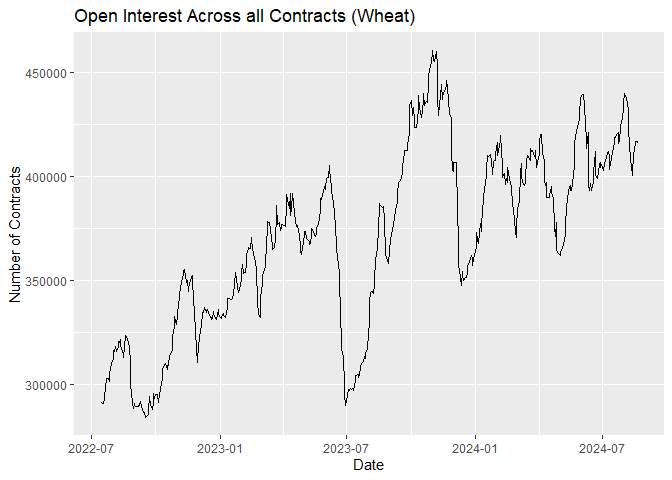
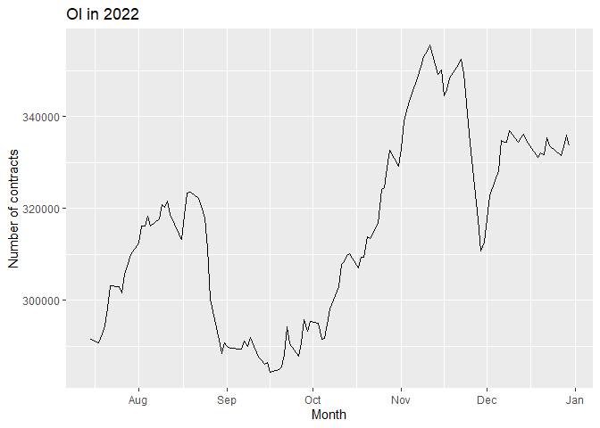
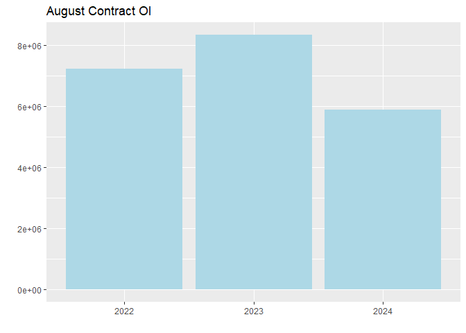
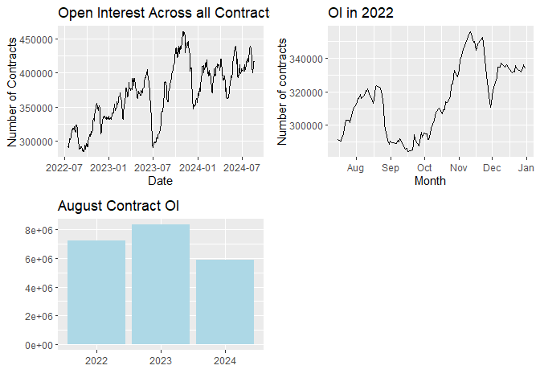

# 0. Objectives

## 0.1 Technical objectives

1.  Learn the functionalities and nuances of various R packages
2.  Understand the difference between various operators and data types
3.  Understand how to handle "date and time" data
4.  Learn how to plot using ggplot package

## 0.2 Conceptual objectives

1.  Understand the concept of open interest

## 0.3 Learning outcome

1.  Able to load and use necessary packages
2.  Able to identify which operator is necessary and use them to solve problems
3.  Able to handle various data types and convert to necessary formats
4.  Able to plot figures as necessary
5.  Able to define and analyse open interest


# 1. Package handling

R packages are a collection of sample code, functions and documentation. They hold various complex functions so that you don't have to hard code them each time.

## 1.1 Install a package

When you encounter a package for the first time ever, you need to "install" the function from CRAN (Comprehensive R Archive Network). This step need not be repeated and the code to install a package should not exist in your notebook/markdown.


``` r
# install.packages("tidyverse")
```

## 1.2 Import packages

Once you have installed a package onto your computer, you need to import only **necessary** packages to your workbook. Below are the packages needed for this specific lab.


``` r
options(warn = -1) # To supress warnings

library(lubridate) # For handling date and time
```

```
## 
## Attaching package: 'lubridate'
```

```
## The following objects are masked from 'package:base':
## 
##     date, intersect, setdiff, union
```

``` r
library(readr)     # For reading data (read_csv, read_excel etc.)
library(tidyverse) # For manipulation of data and data viz (ggplot)
```

```
## ── Attaching core tidyverse packages ──────────────────────── tidyverse 2.0.0 ──
## ✔ dplyr   1.1.4     ✔ stringr 1.5.1
## ✔ forcats 1.0.0     ✔ tibble  3.2.1
## ✔ ggplot2 3.5.1     ✔ tidyr   1.3.1
## ✔ purrr   1.0.2
```

```
## ── Conflicts ────────────────────────────────────────── tidyverse_conflicts() ──
## ✖ dplyr::filter() masks stats::filter()
## ✖ dplyr::lag()    masks stats::lag()
## ℹ Use the conflicted package (<http://conflicted.r-lib.org/>) to force all conflicts to become errors
```

``` r
library(stargazer) # To make presentable table
```

```
## 
## Please cite as: 
## 
##  Hlavac, Marek (2022). stargazer: Well-Formatted Regression and Summary Statistics Tables.
##  R package version 5.2.3. https://CRAN.R-project.org/package=stargazer
```

``` r
library(here)      # To point to the current folder/project
```

```
## here() starts at C:/Users/hp/Desktop/FRE 501/Labs/FRE-501-Labs/Lab 1
```

``` r
library(cowplot)   # Complex display of plots (grid form)
```

```
## 
## Attaching package: 'cowplot'
## 
## The following object is masked from 'package:lubridate':
## 
##     stamp
```

``` r
library(janitor)   # Cleaning df (column names etc)
```

```
## 
## Attaching package: 'janitor'
## 
## The following objects are masked from 'package:stats':
## 
##     chisq.test, fisher.test
```

``` r
library(ggplot2)   # Plot figures
```

## 1.3 Get help

If you have doubts regarding what a library does, or you're looking for some example code, you can use the `help()` function on the console.

```         
help("tidyverse")
```

If you are unsure of a function name and want to look it up, type "?" in the console and start typing the name and look at the suggestions

```         
?read_csv
```

# 2. Read data

One way to read is using the `read_xxx()` function from the readr package, where "xxx" is the file type.

## 2.1 read_csv()


``` r
df_wheat <- read_csv("data/wheat_historical.csv")
```

```
## Rows: 528 Columns: 9
## ── Column specification ────────────────────────────────────────────────────────
## Delimiter: ","
## chr (2): Time, %Chg
## dbl (7): Open, High, Low, Last, Change, Volume, Open Int
## 
## ℹ Use `spec()` to retrieve the full column specification for this data.
## ℹ Specify the column types or set `show_col_types = FALSE` to quiet this message.
```

``` r
head(df_wheat)
```

<div data-pagedtable="false">
  <script data-pagedtable-source type="application/json">
{"columns":[{"label":["Time"],"name":[1],"type":["chr"],"align":["left"]},{"label":["Open"],"name":[2],"type":["dbl"],"align":["right"]},{"label":["High"],"name":[3],"type":["dbl"],"align":["right"]},{"label":["Low"],"name":[4],"type":["dbl"],"align":["right"]},{"label":["Last"],"name":[5],"type":["dbl"],"align":["right"]},{"label":["Change"],"name":[6],"type":["dbl"],"align":["right"]},{"label":["%Chg"],"name":[7],"type":["chr"],"align":["left"]},{"label":["Volume"],"name":[8],"type":["dbl"],"align":["right"]},{"label":["Open Int"],"name":[9],"type":["dbl"],"align":["right"]}],"data":[{"1":"08/20/2024","2":"551.00","3":"559.25","4":"549.50","5":"556.50","6":"4.25","7":"0.77%","8":"112067","9":"415877"},{"1":"08/19/2024","2":"554.50","3":"554.50","4":"545.00","5":"552.25","6":"-0.25","7":"-0.05%","8":"125305","9":"416853"},{"1":"08/16/2024","2":"549.00","3":"555.50","4":"545.50","5":"552.50","6":"2.25","7":"0.41%","8":"123773","9":"416551"},{"1":"08/15/2024","2":"557.50","3":"568.00","4":"548.50","5":"550.25","6":"-6.00","7":"-1.08%","8":"161435","9":"412639"},{"1":"08/14/2024","2":"553.00","3":"559.25","4":"547.50","5":"556.25","6":"4.50","7":"0.82%","8":"201597","9":"410420"},{"1":"08/13/2024","2":"559.75","3":"561.75","4":"548.75","5":"551.75","6":"-8.00","7":"-1.43%","8":"163421","9":"401604"}],"options":{"columns":{"min":{},"max":[10]},"rows":{"min":[10],"max":[10]},"pages":{}}}
  </script>
</div>

## 2.2 read_excel()

Syntax: `read_excel(path, sheet="sheet_name")`

[Read more](https://www.rdocumentation.org/packages/readxl/versions/0.1.1/topics/read_excel) about `read_excel()`


``` r
# This chunk will run into an error

# wheat_2022 <- read_excel("data/wheat_excel.xlsx", sheet = "2022")
# 
# head(wheat_2022)
```

This error means that we haven't installed the required package for `read_excel()`

```         
?read_excel
```


``` r
# install.packages("readxl")
library(readxl)
```


``` r
wheat_2022 <- read_excel("data/wheat_excel.xlsx", sheet = "2022")

head(wheat_2022)
```

<div data-pagedtable="false">
  <script data-pagedtable-source type="application/json">
{"columns":[{"label":["Time"],"name":[1],"type":["chr"],"align":["left"]},{"label":["Open"],"name":[2],"type":["dbl"],"align":["right"]},{"label":["High"],"name":[3],"type":["dbl"],"align":["right"]},{"label":["Low"],"name":[4],"type":["dbl"],"align":["right"]},{"label":["Last"],"name":[5],"type":["dbl"],"align":["right"]},{"label":["Change"],"name":[6],"type":["dbl"],"align":["right"]},{"label":["%Chg"],"name":[7],"type":["dbl"],"align":["right"]},{"label":["Volume"],"name":[8],"type":["dbl"],"align":["right"]},{"label":["Open Int"],"name":[9],"type":["dbl"],"align":["right"]}],"data":[{"1":"10/31/2022","2":"847.25","3":"847.25","4":"847.25","5":"847.25","6":"30.50","7":"0.0373","8":"190594","9":"329100"},{"1":"10/28/2022","2":"816.75","3":"816.75","4":"816.75","5":"816.75","6":"-5.25","7":"-0.0064","8":"62799","9":"332745"},{"1":"10/27/2022","2":"822.00","3":"822.00","4":"822.00","5":"822.00","6":"-1.25","7":"-0.0015","8":"71600","9":"328840"},{"1":"10/26/2022","2":"823.25","3":"823.25","4":"823.25","5":"823.25","6":"6.25","7":"0.0076","8":"69324","9":"324517"},{"1":"10/25/2022","2":"817.00","3":"817.00","4":"817.00","5":"817.00","6":"-1.00","7":"-0.0012","8":"80644","9":"324137"},{"1":"10/24/2022","2":"818.00","3":"818.00","4":"818.00","5":"818.00","6":"-9.00","7":"-0.0109","8":"63618","9":"316858"}],"options":{"columns":{"min":{},"max":[10]},"rows":{"min":[10],"max":[10]},"pages":{}}}
  </script>
</div>

## 2.3 here() function

**`here()`** uses a reasonable heuristics to find your project's files, based on the current working directory at the time when the package is loaded. It will always locate the files relative to your project root.

Syntax:

```         
here("some", "path", "below", "your", "project", "root.txt") 
here("some/path/below/your/project/root.txt")
```


``` r
wheat_2022 <- read_excel(here("data","wheat_excel.xlsx"), sheet = "2022")

head(wheat_2022)
```

<div data-pagedtable="false">
  <script data-pagedtable-source type="application/json">
{"columns":[{"label":["Time"],"name":[1],"type":["chr"],"align":["left"]},{"label":["Open"],"name":[2],"type":["dbl"],"align":["right"]},{"label":["High"],"name":[3],"type":["dbl"],"align":["right"]},{"label":["Low"],"name":[4],"type":["dbl"],"align":["right"]},{"label":["Last"],"name":[5],"type":["dbl"],"align":["right"]},{"label":["Change"],"name":[6],"type":["dbl"],"align":["right"]},{"label":["%Chg"],"name":[7],"type":["dbl"],"align":["right"]},{"label":["Volume"],"name":[8],"type":["dbl"],"align":["right"]},{"label":["Open Int"],"name":[9],"type":["dbl"],"align":["right"]}],"data":[{"1":"10/31/2022","2":"847.25","3":"847.25","4":"847.25","5":"847.25","6":"30.50","7":"0.0373","8":"190594","9":"329100"},{"1":"10/28/2022","2":"816.75","3":"816.75","4":"816.75","5":"816.75","6":"-5.25","7":"-0.0064","8":"62799","9":"332745"},{"1":"10/27/2022","2":"822.00","3":"822.00","4":"822.00","5":"822.00","6":"-1.25","7":"-0.0015","8":"71600","9":"328840"},{"1":"10/26/2022","2":"823.25","3":"823.25","4":"823.25","5":"823.25","6":"6.25","7":"0.0076","8":"69324","9":"324517"},{"1":"10/25/2022","2":"817.00","3":"817.00","4":"817.00","5":"817.00","6":"-1.00","7":"-0.0012","8":"80644","9":"324137"},{"1":"10/24/2022","2":"818.00","3":"818.00","4":"818.00","5":"818.00","6":"-9.00","7":"-0.0109","8":"63618","9":"316858"}],"options":{"columns":{"min":{},"max":[10]},"rows":{"min":[10],"max":[10]},"pages":{}}}
  </script>
</div>

# 3. Clean your data

## 3.1 Skip N rows


``` r
read_excel(here("data","wheat_excel.xlsx"), sheet = "2024")
```

```
## New names:
## • `` -> `...2`
## • `` -> `...3`
## • `` -> `...4`
## • `` -> `...5`
## • `` -> `...6`
## • `` -> `...7`
## • `` -> `...8`
## • `` -> `...9`
```

<div data-pagedtable="false">
  <script data-pagedtable-source type="application/json">
{"columns":[{"label":["This is some text"],"name":[1],"type":["chr"],"align":["left"]},{"label":["...2"],"name":[2],"type":["chr"],"align":["left"]},{"label":["...3"],"name":[3],"type":["chr"],"align":["left"]},{"label":["...4"],"name":[4],"type":["chr"],"align":["left"]},{"label":["...5"],"name":[5],"type":["chr"],"align":["left"]},{"label":["...6"],"name":[6],"type":["chr"],"align":["left"]},{"label":["...7"],"name":[7],"type":["chr"],"align":["left"]},{"label":["...8"],"name":[8],"type":["chr"],"align":["left"]},{"label":["...9"],"name":[9],"type":["chr"],"align":["left"]}],"data":[{"1":"We need to skip this line","2":"NA","3":"NA","4":"NA","5":"NA","6":"NA","7":"NA","8":"NA","9":"NA"},{"1":"Please skip till here","2":"NA","3":"NA","4":"NA","5":"NA","6":"NA","7":"NA","8":"NA","9":"NA"},{"1":"Time","2":"Open","3":"High","4":"Low","5":"Last","6":"Change","7":"%Chg","8":"Volume","9":"Open Int"},{"1":"08/20/2024","2":"551","3":"559.25","4":"549.5","5":"556.5","6":"4.25","7":"7.7000000000000002E-3","8":"112067","9":"415877"},{"1":"08/19/2024","2":"554.5","3":"554.5","4":"545","5":"552.25","6":"-0.25","7":"-5.0000000000000001E-4","8":"125305","9":"416853"},{"1":"08/16/2024","2":"549","3":"555.5","4":"545.5","5":"552.5","6":"2.25","7":"4.1000000000000003E-3","8":"123773","9":"416551"},{"1":"08/15/2024","2":"557.5","3":"568","4":"548.5","5":"550.25","6":"-6","7":"-1.0800000000000001E-2","8":"161435","9":"412639"},{"1":"08/14/2024","2":"553","3":"559.25","4":"547.5","5":"556.25","6":"4.5","7":"8.2000000000000007E-3","8":"201597","9":"410420"},{"1":"08/13/2024","2":"559.75","3":"561.75","4":"548.75","5":"551.75","6":"-8","7":"-1.43E-2","8":"163421","9":"401604"},{"1":"45634","2":"565.75","3":"570","4":"552","5":"559.75","6":"-6","7":"-1.06E-2","8":"185820","9":"400352"},{"1":"45543","2":"561.5","3":"574.75","4":"560.25","5":"565.75","6":"4.25","7":"7.6E-3","8":"172150","9":"408641"},{"1":"45512","2":"562","3":"568.25","4":"557","5":"561.5","6":"-0.5","7":"-8.9999999999999998E-4","8":"154387","9":"414959"}],"options":{"columns":{"min":{},"max":[10]},"rows":{"min":[10],"max":[10]},"pages":{}}}
  </script>
</div>

We can see that the first 3 rows have text and that isn't desirable. Let us skip that to keep the data table clean.


``` r
read_excel(here("data","wheat_excel.xlsx"), sheet = "2024", skip = 3)
```

<div data-pagedtable="false">
  <script data-pagedtable-source type="application/json">
{"columns":[{"label":["Time"],"name":[1],"type":["chr"],"align":["left"]},{"label":["Open"],"name":[2],"type":["dbl"],"align":["right"]},{"label":["High"],"name":[3],"type":["dbl"],"align":["right"]},{"label":["Low"],"name":[4],"type":["dbl"],"align":["right"]},{"label":["Last"],"name":[5],"type":["dbl"],"align":["right"]},{"label":["Change"],"name":[6],"type":["dbl"],"align":["right"]},{"label":["%Chg"],"name":[7],"type":["dbl"],"align":["right"]},{"label":["Volume"],"name":[8],"type":["dbl"],"align":["right"]},{"label":["Open Int"],"name":[9],"type":["dbl"],"align":["right"]}],"data":[{"1":"08/20/2024","2":"551.00","3":"559.25","4":"549.50","5":"556.50","6":"4.25","7":"0.0077","8":"112067","9":"415877"},{"1":"08/19/2024","2":"554.50","3":"554.50","4":"545.00","5":"552.25","6":"-0.25","7":"-0.0005","8":"125305","9":"416853"},{"1":"08/16/2024","2":"549.00","3":"555.50","4":"545.50","5":"552.50","6":"2.25","7":"0.0041","8":"123773","9":"416551"},{"1":"08/15/2024","2":"557.50","3":"568.00","4":"548.50","5":"550.25","6":"-6.00","7":"-0.0108","8":"161435","9":"412639"},{"1":"08/14/2024","2":"553.00","3":"559.25","4":"547.50","5":"556.25","6":"4.50","7":"0.0082","8":"201597","9":"410420"},{"1":"08/13/2024","2":"559.75","3":"561.75","4":"548.75","5":"551.75","6":"-8.00","7":"-0.0143","8":"163421","9":"401604"},{"1":"45634","2":"565.75","3":"570.00","4":"552.00","5":"559.75","6":"-6.00","7":"-0.0106","8":"185820","9":"400352"},{"1":"45543","2":"561.50","3":"574.75","4":"560.25","5":"565.75","6":"4.25","7":"0.0076","8":"172150","9":"408641"},{"1":"45512","2":"562.00","3":"568.25","4":"557.00","5":"561.50","6":"-0.50","7":"-0.0009","8":"154387","9":"414959"}],"options":{"columns":{"min":{},"max":[10]},"rows":{"min":[10],"max":[10]},"pages":{}}}
  </script>
</div>

## 3.2 Clean column names

We want to avoid:

1.  Spaces in names
2.  Random casing (upper and lower)
3.  Remove symbols

Thankfully we have a function that does the job at once!


``` r
df_wheat_clean <- df_wheat |> clean_names()
head(df_wheat_clean)
```

<div data-pagedtable="false">
  <script data-pagedtable-source type="application/json">
{"columns":[{"label":["time"],"name":[1],"type":["chr"],"align":["left"]},{"label":["open"],"name":[2],"type":["dbl"],"align":["right"]},{"label":["high"],"name":[3],"type":["dbl"],"align":["right"]},{"label":["low"],"name":[4],"type":["dbl"],"align":["right"]},{"label":["last"],"name":[5],"type":["dbl"],"align":["right"]},{"label":["change"],"name":[6],"type":["dbl"],"align":["right"]},{"label":["percent_chg"],"name":[7],"type":["chr"],"align":["left"]},{"label":["volume"],"name":[8],"type":["dbl"],"align":["right"]},{"label":["open_int"],"name":[9],"type":["dbl"],"align":["right"]}],"data":[{"1":"08/20/2024","2":"551.00","3":"559.25","4":"549.50","5":"556.50","6":"4.25","7":"0.77%","8":"112067","9":"415877"},{"1":"08/19/2024","2":"554.50","3":"554.50","4":"545.00","5":"552.25","6":"-0.25","7":"-0.05%","8":"125305","9":"416853"},{"1":"08/16/2024","2":"549.00","3":"555.50","4":"545.50","5":"552.50","6":"2.25","7":"0.41%","8":"123773","9":"416551"},{"1":"08/15/2024","2":"557.50","3":"568.00","4":"548.50","5":"550.25","6":"-6.00","7":"-1.08%","8":"161435","9":"412639"},{"1":"08/14/2024","2":"553.00","3":"559.25","4":"547.50","5":"556.25","6":"4.50","7":"0.82%","8":"201597","9":"410420"},{"1":"08/13/2024","2":"559.75","3":"561.75","4":"548.75","5":"551.75","6":"-8.00","7":"-1.43%","8":"163421","9":"401604"}],"options":{"columns":{"min":{},"max":[10]},"rows":{"min":[10],"max":[10]},"pages":{}}}
  </script>
</div>

Why do we need to clean our column names?

Otherwise your code would have looked like this:

```         
wheat_small <- df_wheat |>
                mutate(Time = mdy(Time)) |>
                select(Time, Volume, `Open Int`) 
```

While this works fine, look at how difficult it is to type it out. This code produced a lot of errors before I finally got each section of it correct.

# 4. Data preprocessing using `Dplyr`

Dplyr is a package that helps you to manipulate data in a dataframe. We can select, filter and mutate data within the df.

1.  **Select**: To choose columns from a df
2.  **Filter**: To choose certain rows of data based on a condition
3.  **Mutate**: To change data (from one datatype to another for example); i.e, to manipulate data
4.  **Slice**: To subset rows based on index/position
5.  **Rename**: To change or "rename" column names

## 4.1 Pipe operator `%>%` or `|>`

You will often come across this pipe operator. Both `%>%` and `|>` do the exact same job and mean the same thing. They can be used interchangeably. `|>` is just the newer version of `%>%` and is easier to type.

The pipe operator is used when you want to continue to preprocess a dataframe without saving the intermediate results.


``` r
# For example

test <- df_wheat_clean |> 
            select(volume)
volume_20000 <- test |>
                filter(volume>20000)

head(volume_20000)
```

<div data-pagedtable="false">
  <script data-pagedtable-source type="application/json">
{"columns":[{"label":["volume"],"name":[1],"type":["dbl"],"align":["right"]}],"data":[{"1":"112067"},{"1":"125305"},{"1":"123773"},{"1":"161435"},{"1":"201597"},{"1":"163421"}],"options":{"columns":{"min":{},"max":[10]},"rows":{"min":[10],"max":[10]},"pages":{}}}
  </script>
</div>

Instead of making unnecessary variables, let's try to do that all together.


``` r
volume_filtered <- df_wheat_clean |> 
                    select(volume) |>
                    filter(volume>20000)

head(volume_filtered)
```

<div data-pagedtable="false">
  <script data-pagedtable-source type="application/json">
{"columns":[{"label":["volume"],"name":[1],"type":["dbl"],"align":["right"]}],"data":[{"1":"112067"},{"1":"125305"},{"1":"123773"},{"1":"161435"},{"1":"201597"},{"1":"163421"}],"options":{"columns":{"min":{},"max":[10]},"rows":{"min":[10],"max":[10]},"pages":{}}}
  </script>
</div>

It does the same job!

## 4.2 Dplyr tasks

Now let's play around with dplyr!

The task is to:

1.  Select 3 columns: time, volume and open_int
2.  Create new columns for month and year (Hint: extract from `time`)


``` r
wheat_small <- df_wheat_clean |>
                select(time, volume, open_int) 
head(wheat_small)
```

<div data-pagedtable="false">
  <script data-pagedtable-source type="application/json">
{"columns":[{"label":["time"],"name":[1],"type":["chr"],"align":["left"]},{"label":["volume"],"name":[2],"type":["dbl"],"align":["right"]},{"label":["open_int"],"name":[3],"type":["dbl"],"align":["right"]}],"data":[{"1":"08/20/2024","2":"112067","3":"415877"},{"1":"08/19/2024","2":"125305","3":"416853"},{"1":"08/16/2024","2":"123773","3":"416551"},{"1":"08/15/2024","2":"161435","3":"412639"},{"1":"08/14/2024","2":"201597","3":"410420"},{"1":"08/13/2024","2":"163421","3":"401604"}],"options":{"columns":{"min":{},"max":[10]},"rows":{"min":[10],"max":[10]},"pages":{}}}
  </script>
</div>


``` r
# This chunk will run into an error

# wheat_small <- wheat_small |>
#                 mutate(year = year(time), month = month(time))
# head(wheat_small)
```

What is this error?

```         
The error you're encountering occurs because the time column in your wheat_small data frame is not in a format that R recognizes as a date or datetime. Before using functions like year() and month() from the lubridate package, you need to ensure that the time column is properly converted to a date or datetime object.
```

Let's fix that then!


``` r
wheat_small <- df_wheat_clean |>
                select(time, volume, open_int) |>
                mutate(time = mdy(time)) |> # Converting to date-time object
                mutate(year = year(time), month = month(time))
head(wheat_small)
```

<div data-pagedtable="false">
  <script data-pagedtable-source type="application/json">
{"columns":[{"label":["time"],"name":[1],"type":["date"],"align":["right"]},{"label":["volume"],"name":[2],"type":["dbl"],"align":["right"]},{"label":["open_int"],"name":[3],"type":["dbl"],"align":["right"]},{"label":["year"],"name":[4],"type":["dbl"],"align":["right"]},{"label":["month"],"name":[5],"type":["dbl"],"align":["right"]}],"data":[{"1":"2024-08-20","2":"112067","3":"415877","4":"2024","5":"8"},{"1":"2024-08-19","2":"125305","3":"416853","4":"2024","5":"8"},{"1":"2024-08-16","2":"123773","3":"416551","4":"2024","5":"8"},{"1":"2024-08-15","2":"161435","3":"412639","4":"2024","5":"8"},{"1":"2024-08-14","2":"201597","3":"410420","4":"2024","5":"8"},{"1":"2024-08-13","2":"163421","3":"401604","4":"2024","5":"8"}],"options":{"columns":{"min":{},"max":[10]},"rows":{"min":[10],"max":[10]},"pages":{}}}
  </script>
</div>

Now, suppose I want to pull out rows 3, 4 and 5


``` r
wheat_small |> slice(3:5)
```

<div data-pagedtable="false">
  <script data-pagedtable-source type="application/json">
{"columns":[{"label":["time"],"name":[1],"type":["date"],"align":["right"]},{"label":["volume"],"name":[2],"type":["dbl"],"align":["right"]},{"label":["open_int"],"name":[3],"type":["dbl"],"align":["right"]},{"label":["year"],"name":[4],"type":["dbl"],"align":["right"]},{"label":["month"],"name":[5],"type":["dbl"],"align":["right"]}],"data":[{"1":"2024-08-16","2":"123773","3":"416551","4":"2024","5":"8"},{"1":"2024-08-15","2":"161435","3":"412639","4":"2024","5":"8"},{"1":"2024-08-14","2":"201597","3":"410420","4":"2024","5":"8"}],"options":{"columns":{"min":{},"max":[10]},"rows":{"min":[10],"max":[10]},"pages":{}}}
  </script>
</div>

# 5. Plotting using `ggplot`

## 5.1 Plot open interest across all years


``` r
plt_overall <- ggplot(wheat_small,aes(x=time,y=open_int)) + 
                  geom_line() +
                  labs(title = "Open Interest Across all Contracts (Wheat)",
                        x = "Date",
                        y = "Number of Contracts")
plt_overall
```

<!-- -->

## 5.2 Plot OI for one particular year


``` r
wheat_2022 <- wheat_small |> filter(year==2022)

plt_2022 <- ggplot(wheat_2022, aes(x=time,y=open_int)) + 
              geom_line() +
              labs(title = "OI in 2022",x = "Month",
                   y = "Number of contracts") 
plt_2022
```

<!-- -->

## 5.3 Plot OI for one specific month (all years)


``` r
month_data <- wheat_small |> filter(month == 8)

plt_month <- ggplot(month_data, 
                    aes(x = factor(year), y = open_int)) + 
                geom_col(fill = "lightblue") +
                labs(title = "August Contract OI",x = "",y = "")

plt_month
```

<!-- -->

### Note: [Factors](https://www.rdocumentation.org/packages/base/versions/3.6.2/topics/factor)

In this graph, we see the use of `factor` (in x = factor(Year)). `factor` returns an object of class "factor" having a set of "levels" which are unique and of character type.

## 5.4 Plotting in a grid


``` r
plot_grid(plt_overall, plt_2022, plt_month,
          ncol = 2,          
          align = 'v')
```

<!-- -->

## 5.5 Export your graph


``` r
png(filename="img/aug_plot.png")
print(plt_month)
dev.off()
```

```
## png 
##   2
```

# 6. `lm()` to fit linear models

## 6.1 Create month and year dummies

The goal is to simulate a one-hot encoded columns for month and year: 


``` r
wheat_small <- wheat_small %>%
                mutate(d1 = ifelse(month==1,1,0),
                       d2 = ifelse(month==2,1,0),
                       d3 = ifelse(month==3,1,0),
                       d4 = ifelse(month==4,1,0),
                       d5 = ifelse(month==5,1,0),
                       d6 = ifelse(month==6,1,0),
                       d7 = ifelse(month==7,1,0),
                       d8 = ifelse(month==8,1,0),
                       d9 = ifelse(month==9,1,0),
                       d10 = ifelse(month==10,1,0),
                       d11 = ifelse(month==11,1,0),
                       D2022 = ifelse(year==2022,1,0),
                       D2023 = ifelse(year==2023,1,0),
                       D2024 = ifelse(year==2024,1,0))

head(wheat_small)
```

<div data-pagedtable="false">
  <script data-pagedtable-source type="application/json">
{"columns":[{"label":["time"],"name":[1],"type":["date"],"align":["right"]},{"label":["volume"],"name":[2],"type":["dbl"],"align":["right"]},{"label":["open_int"],"name":[3],"type":["dbl"],"align":["right"]},{"label":["year"],"name":[4],"type":["dbl"],"align":["right"]},{"label":["month"],"name":[5],"type":["dbl"],"align":["right"]},{"label":["d1"],"name":[6],"type":["dbl"],"align":["right"]},{"label":["d2"],"name":[7],"type":["dbl"],"align":["right"]},{"label":["d3"],"name":[8],"type":["dbl"],"align":["right"]},{"label":["d4"],"name":[9],"type":["dbl"],"align":["right"]},{"label":["d5"],"name":[10],"type":["dbl"],"align":["right"]},{"label":["d6"],"name":[11],"type":["dbl"],"align":["right"]},{"label":["d7"],"name":[12],"type":["dbl"],"align":["right"]},{"label":["d8"],"name":[13],"type":["dbl"],"align":["right"]},{"label":["d9"],"name":[14],"type":["dbl"],"align":["right"]},{"label":["d10"],"name":[15],"type":["dbl"],"align":["right"]},{"label":["d11"],"name":[16],"type":["dbl"],"align":["right"]},{"label":["D2022"],"name":[17],"type":["dbl"],"align":["right"]},{"label":["D2023"],"name":[18],"type":["dbl"],"align":["right"]},{"label":["D2024"],"name":[19],"type":["dbl"],"align":["right"]}],"data":[{"1":"2024-08-20","2":"112067","3":"415877","4":"2024","5":"8","6":"0","7":"0","8":"0","9":"0","10":"0","11":"0","12":"0","13":"1","14":"0","15":"0","16":"0","17":"0","18":"0","19":"1"},{"1":"2024-08-19","2":"125305","3":"416853","4":"2024","5":"8","6":"0","7":"0","8":"0","9":"0","10":"0","11":"0","12":"0","13":"1","14":"0","15":"0","16":"0","17":"0","18":"0","19":"1"},{"1":"2024-08-16","2":"123773","3":"416551","4":"2024","5":"8","6":"0","7":"0","8":"0","9":"0","10":"0","11":"0","12":"0","13":"1","14":"0","15":"0","16":"0","17":"0","18":"0","19":"1"},{"1":"2024-08-15","2":"161435","3":"412639","4":"2024","5":"8","6":"0","7":"0","8":"0","9":"0","10":"0","11":"0","12":"0","13":"1","14":"0","15":"0","16":"0","17":"0","18":"0","19":"1"},{"1":"2024-08-14","2":"201597","3":"410420","4":"2024","5":"8","6":"0","7":"0","8":"0","9":"0","10":"0","11":"0","12":"0","13":"1","14":"0","15":"0","16":"0","17":"0","18":"0","19":"1"},{"1":"2024-08-13","2":"163421","3":"401604","4":"2024","5":"8","6":"0","7":"0","8":"0","9":"0","10":"0","11":"0","12":"0","13":"1","14":"0","15":"0","16":"0","17":"0","18":"0","19":"1"}],"options":{"columns":{"min":{},"max":[10]},"rows":{"min":[10],"max":[10]},"pages":{}}}
  </script>
</div>

### Note: if_else() v/s case_when()

Read more : <https://www.rdocumentation.org/packages/dplyr/versions/1.0.10/topics/case_when>

`case_when()` can be used instead if these multiple if-else statements. However, getting used to coding using case-when can be a bit challenging and is beyond the scope of this lab.

## 6.2 Regression

A linear model is used to predict the value of an unknown variable based on independent variables. It is mostly used for finding out the relationship between variables and forecasting. 

```         
Syntax : lm(formula, data = your_data)
Example: lm(y~x^2, data = df)
```


``` r
wheat_lm <- lm(open_int ~ d1 + d2 + d3 + d4 + d5 + d6 + d7 + d8 + d9 + d10 +
                     d11 + D2022 + D2023 + D2024,
                   data = wheat_small)
summary(wheat_lm)
```

```
## 
## Call:
## lm(formula = open_int ~ d1 + d2 + d3 + d4 + d5 + d6 + d7 + d8 + 
##     d9 + d10 + d11 + D2022 + D2023 + D2024, data = wheat_small)
## 
## Residuals:
##    Min     1Q Median     3Q    Max 
## -71923 -14976   2285  18254  51768 
## 
## Coefficients: (1 not defined because of singularities)
##             Estimate Std. Error t value Pr(>|t|)    
## (Intercept)   431085       4486  96.107  < 2e-16 ***
## d1            -41511       5361  -7.744 5.17e-14 ***
## d2            -32490       5422  -5.993 3.89e-09 ***
## d3            -22163       5282  -4.196 3.21e-05 ***
## d4            -24959       5373  -4.645 4.33e-06 ***
## d5            -22699       5273  -4.305 2.00e-05 ***
## d6            -25489       5372  -4.744 2.71e-06 ***
## d7            -39938       4916  -8.125 3.35e-15 ***
## d8            -11615       4673  -2.485   0.0133 *  
## d9             -4958       5045  -0.983   0.3262    
## d10            24896       4986   4.993 8.16e-07 ***
## d11            40768       5015   8.129 3.25e-15 ***
## D2022        -119931       3539 -33.888  < 2e-16 ***
## D2023         -43735       2493 -17.541  < 2e-16 ***
## D2024             NA         NA      NA       NA    
## ---
## Signif. codes:  0 '***' 0.001 '**' 0.01 '*' 0.05 '.' 0.1 ' ' 1
## 
## Residual standard error: 22840 on 514 degrees of freedom
## Multiple R-squared:  0.7352,	Adjusted R-squared:  0.7285 
## F-statistic: 109.8 on 13 and 514 DF,  p-value: < 2.2e-16
```

# 7. Print in a readable table : `stargazer` package


``` r
stargazer(wheat_lm, type = "text", digits = 0,
          title="Results", align=TRUE)
```

```
## 
## Results
## ===============================================
##                         Dependent variable:    
##                     ---------------------------
##                              open_int          
## -----------------------------------------------
## d1                          -41,511***         
##                               (5,361)          
##                                                
## d2                          -32,490***         
##                               (5,421)          
##                                                
## d3                          -22,163***         
##                               (5,282)          
##                                                
## d4                          -24,959***         
##                               (5,373)          
##                                                
## d5                          -22,699***         
##                               (5,273)          
##                                                
## d6                          -25,489***         
##                               (5,372)          
##                                                
## d7                          -39,938***         
##                               (4,915)          
##                                                
## d8                           -11,615**         
##                               (4,673)          
##                                                
## d9                            -4,958           
##                               (5,045)          
##                                                
## d10                          24,896***         
##                               (4,986)          
##                                                
## d11                          40,768***         
##                               (5,015)          
##                                                
## D2022                       -119,931***        
##                               (3,539)          
##                                                
## D2023                       -43,735***         
##                               (2,493)          
##                                                
## D2024                                          
##                                                
##                                                
## Constant                    431,085***         
##                               (4,485)          
##                                                
## -----------------------------------------------
## Observations                    528            
## R2                               1             
## Adjusted R2                      1             
## Residual Std. Error      22,842 (df = 514)     
## F Statistic            110*** (df = 13; 514)   
## ===============================================
## Note:               *p<0.1; **p<0.05; ***p<0.01
```

# 8. Best practices

1.  To name dataframes, use `df` as a predecessor. Eg: df_school, df_wheat, df_wheat_2022 etc. Make sure they tell you exactly what they hold. Keep it short.
2.  For variables, remember to use "snake_case". Keep it short as well.
3.  Do not create new names each time you make changes to the df.
    1.  This is arbitrary, there are no strict rules.
    2.  Try to re-use names, but don't over use the same name. You will learn the trade-off as you code more.

# 9. Save your work as an R Project (Optional)

1.  Create a new R Project
2.  Create R Project in existing library
3.  Navigate to your current directory
4.  Done!
