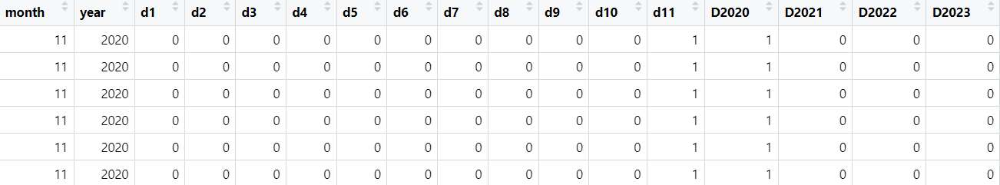

# 0. Objectives

## 0.1 Lab objective

1.  Learn the functionalities and nuances of various R packages
2.  Understand the difference between various operators and data types
3.  Understand how to handle "date and time" data
4.  Learn how to plot using ggplot package

## 0.2 Learning outcome

1.  Able to load and use necessary packages
2.  Able to identify which operator is necessary and use them to solve problems
3.  Able to handle various data types and convert to necessary formats
4.  Able to plot figures as necessary

```{r setup, include = FALSE}
knitr::opts_chunk$set(eval = FALSE)
```

# 1. Package handling

R packages are a collection of sample code, functions and documentation. They hold various complex functions so that you don't have to hard code them each time.

## 1.1 Install a package

When you encounter a package for the first time ever, you need to "install" the function from CRAN (Comprehensive R Archive Network). This step need not be repeated and the code to install a package should not exist in your notebook/markdown.

```{r}
# install.packages("tidyverse")
```

## 1.2 Import packages

Once you have installed a package onto your computer, you need to import only **necessary** packages to your workbook. Below are the packages needed for this specific lab.

```{r}

# options(warn = -1) # To supress warnings

library(lubridate) # For handling date and time
library(readr)     # For reading data (read_csv, read_excel etc.)
library(tidyverse) # For manipulation of data and data viz (ggplot)
library(stargazer) # To make presentable table
library(here)      # To point to the current folder/project
library(cowplot)   # Complex display of plots (grid form)
library(janitor)   # Cleaning df (column names etc)
library(ggplot2)   # Plot figures
```

## 1.3 Get help

If you have doubts regarding what a library does, or you're looking for some example code, you can use the `help()` function on the console.

```         
help("tidyverse")
```

If you are unsure of a function name and want to look it up, type "?" in the console and start typing the name and look at the suggestions

```         
?read_csv
```

# 2. Read data

One way to read is using the `read_xxx()` function from the readr package, where "xxx" is the file type.

## 2.1 read_csv()

```{r}
df_wheat <- read_csv("data/wheat_historical.csv")
head(df_wheat)
```

## 2.2 read_excel()

Syntax: `read_excel(path, sheet="sheet_name")`

[Read more](https://www.rdocumentation.org/packages/readxl/versions/0.1.1/topics/read_excel) about `read_excel()`

```{r}
# This chunk will run into an error

wheat_2022 <- read_excel("data/wheat_excel.xlsx", sheet = "2022")

head(wheat_2022)
```

This error means that we haven't installed the required package for `read_excel()`

```         
?read_excel
```

```{r}
# install.packages("readxl")
library(readxl)
```

```{r}
wheat_2022 <- read_excel("data/wheat_excel.xlsx", sheet = "2022")

head(wheat_2022)
```

## 2.3 here() function

**`here()`** uses a reasonable heuristics to find your project's files, based on the current working directory at the time when the package is loaded. It will always locate the files relative to your project root.

Syntax:

```         
here("some", "path", "below", "your", "project", "root.txt") 
here("some/path/below/your/project/root.txt")
```

```{r}
wheat_2022 <- read_excel(here("data","wheat_excel.xlsx"), sheet = "2022")

head(wheat_2022)
```

# 3. Clean your data

## 3.1 Skip N rows

```{r}
read_excel(here("data","wheat_excel.xlsx"), sheet = "2024")
```

We can see that the first 3 rows have text and that isn't desirable. Let us skip that to keep the data table clean.

```{r}
read_excel(here("data","wheat_excel.xlsx"), sheet = "2024", skip = 3)
```

## 3.2 Clean column names

We want to avoid:

1.  Spaces in names
2.  Random casing (upper and lower)
3.  Remove symbols

Thankfully we have a function that does the job at once!

```{r}
df_wheat_clean <- df_wheat |> clean_names()
head(df_wheat_clean)
```

Why do we need to clean our column names?

Otherwise your code would have looked like this:

```         
wheat_small <- df_wheat |>
                mutate(Time = mdy(Time)) |>
                select(Time, Volume, `Open Int`) 
```

While this works fine, look at how difficult it is to type it out. This code produced a lot of errors before I finally got each section of it correct.

# 4. Data preprocessing using `Dplyr`

Dplyr is a package that helps you to manipulate data in a dataframe. We can select, filter and mutate data within the df.

1.  Select: To choose columns from a df
2.  Filter: To choose certain rows of data based on a condition
3.  Mutate: To change data (from one datatype to another for example); i.e, to manipulate data

## 4.1 Pipe operator `%>%` or `|>`

You will often come across this pipe operator. Both `%>%` and `|>` do the exact same job and mean the same thing. They can be used interchangeably. `|>` is just the newer version of `%>%` and is easier to type.

The pipe operator is used when you want to continue to preprocess a dataframe without saving the intermediate results.

```{r}
# For example

test <- df_wheat_clean |> 
            select(volume)
volume_20000 <- test |>
                filter(volume>20000)

head(volume_20000)
```

Instead of making unnecessary variables, let's try to do that all together.

```{r}

volume_filtered <- df_wheat_clean |> 
                    select(volume) |>
                    filter(volume>20000)

head(volume_filtered)
```

It does the same job!

## 4.2 Dplyr tasks

Now let's play around with dplyr!

The task is to:

1.  select 3 columns: time, volumne and open_int
2.  Create new columns for month and year (Hint: extract from `time`)

```{r}
wheat_small <- df_wheat_clean |>
                select(time, volume, open_int) 
head(wheat_small)
```

```{r}
# This chunk will run into an error

wheat_small <- wheat_small |>
                mutate(year = year(time), month = month(time))
head(wheat_small)
```

What is this error?

```         
The error you're encountering occurs because the time column in your wheat_small data frame is not in a format that R recognizes as a date or datetime. Before using functions like year() and month() from the lubridate package, you need to ensure that the time column is properly converted to a date or datetime object.
```

Let's fix that then!

```{r}
wheat_small <- df_wheat_clean |>
                select(time, volume, open_int) |>
                mutate(time = mdy(time)) |> # Converting to date-time object
                mutate(year = year(time), month = month(time))
head(wheat_small)
```

# 5. Plotting using `ggplot`

## 5.1 Plot open interest across all years

```{r}
plt_overall <- ggplot(wheat_small,aes(x=time,y=open_int)) + 
                  geom_line() +
                  labs(title = "Open Interest Across all Contracts (Wheat)",
                        x = "Date",
                        y = "Number of Contracts")
plt_overall
```

## 5.2 Plot OI for one particular year

```{r}
wheat_2022 <- wheat_small |> filter(year==2022)

plt_2022 <- ggplot(wheat_2022, aes(x=time,y=open_int)) + 
              geom_line() +
              labs(title = "OI in 2022",x = "Month",
                   y = "Number of contracts") 
plt_2022
```

## 5.3 Plot OI for one specific month (all years)

```{r}
month_data <- wheat_small |> filter(month == 8)

plt_month <- ggplot(month_data, 
                    aes(x = factor(year), y = open_int)) + 
                geom_col(fill = "lightblue") +
                labs(title = "August Contract OI",x = "",y = "")

plt_month
```

### Note: [Factors](https://www.rdocumentation.org/packages/base/versions/3.6.2/topics/factor)

In this graph, we see the use of `factor` (in x = factor(Year)). `factor` returns an object of class "factor" having a set of "levels" which are unique and of character type.

## 5.4 Plotting in a grid

```{r}
plot_grid(plt_overall, plt_2022, plt_month,
          ncol = 2,          
          align = 'v')
```

## 5.5 Export your graph

```{r}
png(filename="img/aug_plot.png")
print(plt_month)
dev.off()
```

# 6. `lm()` to fit linear models

## 6.1 Create month and year dummies

The goal is to simulate a one-hot encoded columns for month and year: 

```{r}
wheat_small <- wheat_small %>%
                mutate(d1 = ifelse(month==1,1,0),
                       d2 = ifelse(month==2,1,0),
                       d3 = ifelse(month==3,1,0),
                       d4 = ifelse(month==4,1,0),
                       d5 = ifelse(month==5,1,0),
                       d6 = ifelse(month==6,1,0),
                       d7 = ifelse(month==7,1,0),
                       d8 = ifelse(month==8,1,0),
                       d9 = ifelse(month==9,1,0),
                       d10 = ifelse(month==10,1,0),
                       d11 = ifelse(month==11,1,0),
                       D2022 = ifelse(year==2022,1,0),
                       D2023 = ifelse(year==2023,1,0),
                       D2024 = ifelse(year==2024,1,0))

head(wheat_small)
```

### Note: if_else() v/s case_when()

Read more : <https://www.rdocumentation.org/packages/dplyr/versions/1.0.10/topics/case_when>

`case_when()` can be used instead if these multiple if-else statements. However, getting used to coding using case-when can be a bit challenging and is beyond the scope of this lab.

## 6.2 Regression

A linear model is used to predict the value of an unknown variable based on independent variables. It is mostly used for finding out the relationship between variables and forecasting. 

```         
Syntax : lm(formula, data = your_data)
Example: lm(y~x^2, data = df)
```

```{r}
wheat_lm <- lm(open_int ~ d1 + d2 + d3 + d4 + d5 + d6 + d7 + d8 + d9 + d10 +
                     d11 + D2022 + D2023 + D2024,
                   data = wheat_small)
summary(wheat_lm)
```

# 7. Print in a readable table : `stargazer` package

```{r}
stargazer(wheat_lm, type = "text", digits = 0,
          title="Results", align=TRUE)
```

# 8. Best practices

1.  To name dataframes, use `df` as a predecessor. Eg: df_school, df_wheat, df_wheat_2022 etc. Make sure they tell you exactly what they hold. Keep it short.
2.  For variables, remember to use "snake_case". Keep it short as well.
3.  Do not create new names each time you make changes to the df.
    1.  This is arbitrary, there are no strict rules.
    2.  Try to re-use names, but don't over use the same name. You will learn the trade-off as you code more.

# 9. Save your work as an R Project

1.  Create a new R Project
2.  Create R Project in existing library
3.  Navigate to your current directory
4.  Done!
